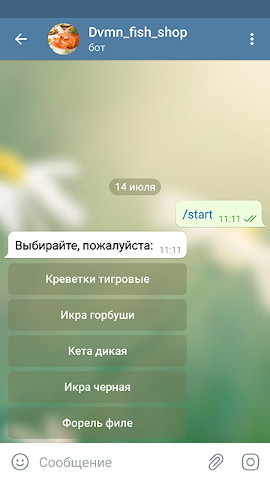
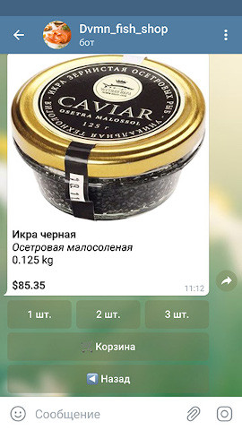
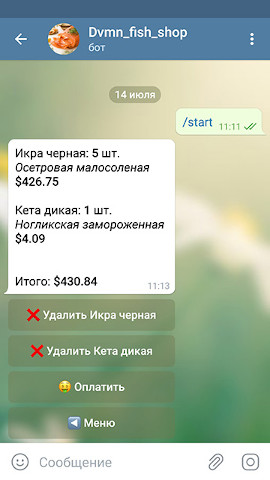

# TelegramShop
Телеграм-бот для продажи товаров на базе интернет-магазина [elasticpath.com](https://www.elasticpath.com/)
 - [Бот](https://t.me/Dvmn_fish_shop_bot)

  
### Деплой
```
git clone https://github.com/j0hntv/TelegramShop.git
cd TelegramShop
python3.8 -m venv env
. env/bin/activate
pip install -r requirements.txt
```
- Переменные окружения `.env`:
```
CLIENT_ID=
CLIENT_SECRET=
TELEGRAM_TOKEN=
REDIS_HOST=
REDIS_PORT=
REDIS_PASSWORD=
```
`CLIENT_ID` и `CLIENT_SECRET` необходимо получить у администратора интернет-магазина. 
### Запуск
```
python main.py
```
## Цели проекта

Код написан в учебных целях — это урок в курсе по Python и веб-разработке на сайте [Devman](https://dvmn.org).